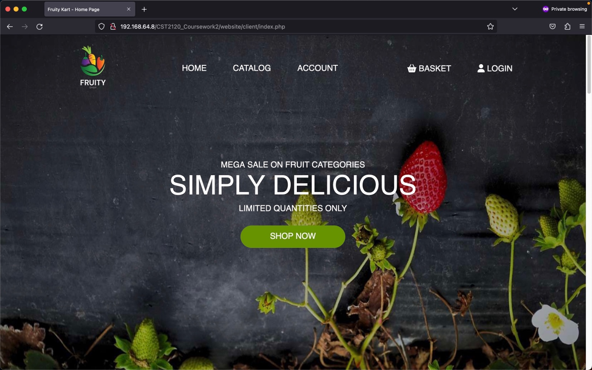

# Fruity Kart E-commerce Website

This project adopted a minimalist web design to simplify the user interface by removing unnecessary elements to focus more on user readability and functionality.

It is composed of a client-side where the clients can order their favorite fruits and a content management system (CMS) where only admin access users can manage the products stocks and orders.

## Features

- Shopping functionality (Add to cart, Remove from cart, Update cart, Checkout)
- Search for product
- Customer Sign up and Login
- Customer Tracking and Recommendations
- Content Management System (CMS)

## Technologies

- HTML
- CSS
- JavaScript
- PHP
- MongoDB
- Jquery and Jquery UI

## Installation

1. Install and start XAMP/LAMP/MAMP server depending on your operating system.

2. Navigate to `/var/www/html` and clone the repository

    ```bash
    cd /var/www/html && git clone https://github.com/derecklhw/fruitykart_ecommerce_website.git
    ```

3. Restore the database

    ```bash
    mongorestore --dir=db_dump
    ```

4. Navigate to `http://localhost/fruitykart_ecommerce_website` in your browser.

## Screenshots

### Homepage



### Product Page


### Cart Page


### Recommendations


### Admin Page


